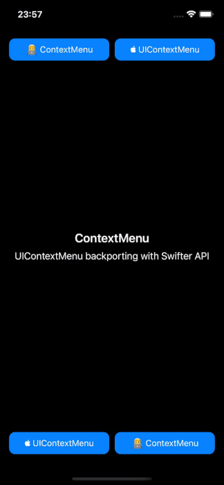
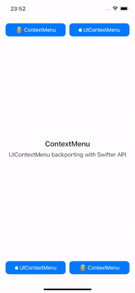

[](https://cocoapods.org/pods/SwiftyContextMenu)
[](https://cocoapods.org/pods/SwiftyContextMenu)
[](https://cocoapods.org/pods/SwiftyContextMenu)

| Light mode | Dark mode | Runtime change |
| --- | --- | --- |
|  |  |   |

## Example

To run the example project, clone the repo, and run `pod install` from the Example directory first.

## Requirements

* iOS 10+

## Installation

ContextMenu is available through [CocoaPods](https://cocoapods.org). To install
it, simply add the following line to your Podfile:

```ruby
pod 'SwiftyContextMenu'
```

## Usage

```swift
let favoriteAction = ContextMenuAction(title: "Looooooooooooong title",
                                       image: UIImage(named: "heart.fill"),
                                       action: { _ in print("favorite") })
let shareAction = ContextMenuAction(title: "Share",
                                    image: UIImage(named: "square.and.arrow.up.fill"),
                                    action: { _ in print("square") })
let deleteAction = ContextMenuAction(title: "Delete",
                                     image: UIImage(named: "trash.fill"),
                                     tintColor: UIColor.red,
                                     action: { _ in print("delete") })
let actions = [favoriteAction, shareAction, deleteAction]
let contextMenu = ContextMenu(title: "Actions", actions: actions)
button.addContextMenu(contextMenu, for: .tap(numberOfTaps: 1), .longPress(duration: 0.3))
```

### Dark mode
By default the `ContextMenu` adapts his style automatically with the system (> iOS 13) but you can force an appearance if you want.

```swift
let favoriteAction = ContextMenuAction(
	title: "Like",
	image: UIImage(named: "heart.fill"),
	tintColor: UIColor.black,
	tintColorDark: UIColor.white,
	action: { _ in }
)
                                               
let contextMenu = ContextMenu(
	mode: .light, //.automatic, .light or .dark
	title: "Actions",
	actions: actions
)

```
If you set mode to `.automatic` please be sure to provide a `tintColor` to the `ContextMenuAction` that contains light and dark appearance. (When set to `.automatic` only `tintColor` is applied.)

## Author

Mario Iannotta, info@marioiannotta.com.

If you like this git you can follow me here or on Twitter [@MarioIannotta](http://www.twitter.com/marioiannotta); sometimes I post interesting stuff. 

## License

ContextMenu is available under the MIT license. See the LICENSE file for more info.

## TODOs:

* [ ] Document all the public stuff
* [x] Support dark mode
* [ ] Improve the Readme Usage section
* [x] Support dynamic type
